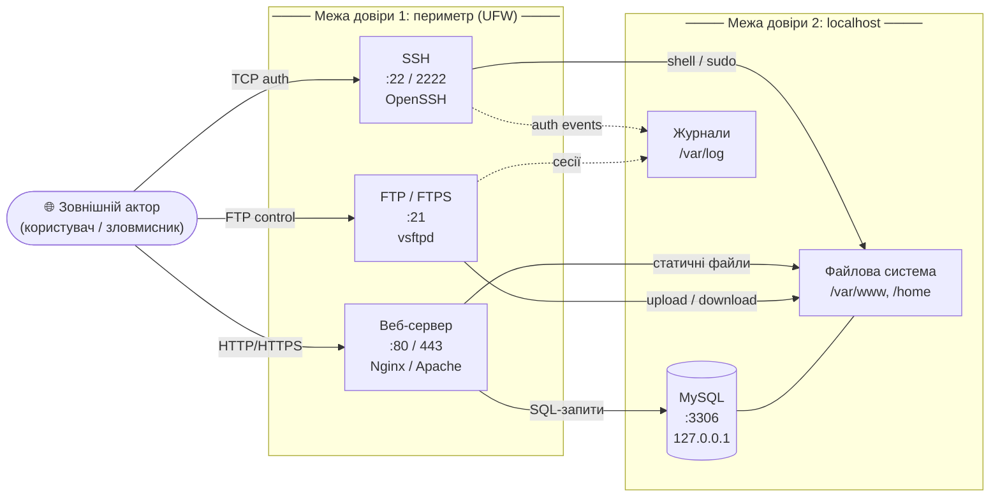

# Розділ 1. Аналіз вразливостей та моделювання загроз типового веб-сервера

## 1.1. Архітектурні особливості та безпекові можливості Ubuntu 24.04 LTS

Ubuntu 24.04 LTS вийшов у квітні 2024 року під кодовою назвою Noble Numbat і отримуватиме оновлення безпеки від Canonical до квітня 2029 року. Це важливо не лише як факт про конкретний реліз, а й як характеристика платформи, на якій у цій роботі розглядається типовий серверний стек. У версії 24.04 Ubuntu отримала кілька змін, що помітно впливають на безпекову модель системи.

### Що нового в безпеці

**Ядро Linux 6.8 із посиленим binary hardening.** У цій версії підвищено рівень FORTIFY_SOURCE до 3, що означає жорсткішу перевірку меж пам’яті під час виклику стандартних функцій на зразок `memcpy()` та `snprintf()`. На практиці це зменшує ризик цілого класу помилок, пов’язаних із роботою з пам’яттю, ще на рівні ядра.

**AppArmor 4.0.** Нова версія AppArmor отримала більш гнучкі можливості для побудови політик доступу та точнішого контролю над діями процесів. Для серверного середовища це означає кращу ізоляцію служб і менші наслідки у разі компрометації окремого процесу.

**Обмеження непривілейованих user namespaces.** Це одна з найважливіших змін у Ubuntu 24.04. User namespaces дозволяють програмі працювати в умовному режимі root, не маючи реальних привілеїв у системі. Такий механізм корисний для контейнерів і sandbox-середовищ, але водночас він неодноразово ставав джерелом атак. У Ubuntu 24.04 доступ до user namespaces за замовчуванням обмежений через AppArmor. Водночас у 2025 році дослідники Qualys показали, що існують обхідні шляхи цього механізму через стандартні утиліти, тому навіть сильні вбудовані засоби захисту не можуть бути єдиною лінією оборони.

**Відключення застарілих версій TLS.** За замовчуванням Ubuntu 24.04 вимикає TLS 1.0, TLS 1.1 та DTLS 1.0. Ці протоколи давно вважаються слабкими через відомі атаки на зниження рівня шифрування, тому їх відключення є логічним кроком у бік безпечнішої базової конфігурації.

### Що Ubuntu не робить за вас

Попри ці покращення, Ubuntu 24.04, як і будь-який інший дистрибутив, орієнтується на сумісність і зручність першого запуску, а не на максимальний рівень захисту. Це означає, що частину критичних налаштувань адміністратор має виконати самостійно.

- SSH встановлюється з увімкненою парольною автентифікацією і, залежно від конфігурації, може дозволяти вхід під root.
- Nginx і Apache не приховують технічну інформацію про сервер за замовчуванням.
- MySQL і vsftpd при стандартній установці не мають додаткових мережевих обмежень понад базові значення пакета.
- UFW присутній у системі, але за замовчуванням вимкнений.

Отже, Ubuntu 24.04 справді дає хороший базовий фундамент, але не звільняє адміністратора від необхідності окремо налаштовувати сервіси, які на цьому фундаменті працюють.

## 1.2. Аналіз базового технологічного стеку веб-сервера

Типовий веб-сервер на Ubuntu складається з чотирьох основних компонентів: SSH для віддаленого доступу, веб-сервера на кшталт Nginx або Apache, бази даних MySQL або MariaDB та засобу передавання файлів, найчастіше FTP або FTPS. У кожного з цих елементів є власні ризики, причому вони виникають не лише через програмні вразливості, а й через звичайні дефолтні налаштування.

### 1.2.1. Мережевий доступ та віддалене адміністрування через SSH

SSH є головною точкою доступу до сервера, тому саме цей сервіс найчастіше стає мішенню для атак. Сам протокол є надійним, але рівень безпеки сильно залежить від того, як він налаштований.

Ubuntu 24.04 постачається з OpenSSH версії 9.6p1. У стандартній конфігурації:

- SSH слухає на порту 22, який першим перевіряють автоматизовані сканери.
- Дозволена парольна автентифікація, що створює умови для brute-force атак.
- Залежно від конфігурації може бути дозволений вхід під root.
- Версія OpenSSH і банер сервісу можуть бути видимі ще до автентифікації.

### 1.2.2. Рівень веб-сервісів: Nginx та Apache 2.4

Nginx і Apache — це два найпоширеніші веб-сервери для типового LAMP/LEMP-стеку. З погляду безпеки їхні дефолтні проблеми схожі, але відрізняються деталями реалізації.

**Розкриття технічної інформації.** Обидва сервери за замовчуванням вказують свою версію в заголовку `Server`. У випадку Nginx ця інформація може з’являтися навіть на сторінках помилок. Для атакуючого це зручна підказка, бо дає змогу швидко звірити версію з відомими вразливостями. Саме тому параметри на кшталт `server_tokens off` для Nginx або `ServerTokens Prod` для Apache вважаються базовими заходами захисту.

### 1.2.3. Рівень збереження даних: MySQL / MariaDB

MySQL і MariaDB у типовому веб-хостингу використовуються як сховище даних для CMS, інтернет-магазинів та інших вебзастосунків. Їхні стандартні конфігурації несуть два основні типи ризиків.

**Перший тип — мережева доступність.** За даними Shadowserver Foundation, у відкритому Інтернеті є мільйони MySQL-серверів, які відповідають на з’єднання через порт 3306/TCP. У більшості випадків такий зовнішній доступ не потрібен, бо база даних працює разом із вебсервером на одній машині й має бути доступна лише через localhost. Налаштування `bind-address = 127.0.0.1` дозволяє прибрати цей клас ризиків без втрати функціональності.

**Другий тип — стан після інсталяції.** Навіть коли зовнішній порт не відкритий, стандартна установка MySQL може містити тестову базу, анонімного користувача або слабкі облікові записи. Саме для цього існує `mysql_secure_installation`, але вона не запускається автоматично і потребує ручного виконання.

### 1.2.4. Протоколи передавання файлів: FTP / FTPS та їхні ризики

FTP є одним із найстаріших протоколів передавання файлів, і його класична версія залишається небезпечною. Основна проблема в тому, що логін і пароль передаються відкритим текстом. Якщо трафік можна перехопити, облікові дані фактично одразу стають відомі сторонній особі.

vsftpd, який часто використовується в Ubuntu, за замовчуванням не вмикає TLS і не ізолює користувачів через `chroot`. Через це FTP-з’єднання без додаткового налаштування створює одразу дві проблеми: відсутність шифрування і слабку ізоляцію файлової системи.

## 1.3. Моделювання загроз за методологією STRIDE

STRIDE — це проста й зручна модель загроз, яка поділяє атаки на шість груп: Spoofing, Tampering, Repudiation, Information Disclosure, Denial of Service та Elevation of Privilege. Її перевага в тому, що вона допомагає системно пройтися по кожному компоненту і не пропустити очевидні ризики.

Формально STRIDE застосовується до діаграм потоків даних, де межі довіри показують місця перетину між зовнішнім середовищем і внутрішніми компонентами системи. Нижче подано спрощену схему типового веб-сервера, який розглядається в роботі.

### Діаграма потоків даних (DFD)

*Рисунок 1.1 — Діаграма потоків даних типового веб-сервера. Суцільні стрілки показують потоки даних, пунктирні — події журналювання. Межі довіри вказують на точки, де особливо важливо враховувати загрози STRIDE*.

Матриця нижче узагальнює основні загрози для типового веб-сервера та відповідні контрзаходи.

### Матриця загроз STRIDE

| Компонент | Категорія STRIDE | Загроза | Контрзахід | Рівень ризику |
|---|---|---|---|---|
| SSH | Information Disclosure | Розкриття версії OpenSSH через banner до автентифікації | Обмеження інформації pre-auth | Low |
| SSH | Elevation of Privilege | Brute-force парольної автентифікації, у тому числі під root | `PermitRootLogin no`, `PasswordAuthentication no`, Fail2Ban | High |
| SSH | Spoofing | Підміна ключів під час першого підключення | Попереднє додавання відбитка ключа в `known_hosts` | Medium |
| SSH | Denial of Service | Перевантаження сервера великою кількістю з’єднань | `MaxStartups`, `LoginGraceTime`, rate limiting | Medium |
| Web (Nginx/Apache) | Information Disclosure | Розкриття версії сервера в заголовку `Server` | `server_tokens off` / `ServerTokens Prod` | Low |
| Web (Nginx/Apache) | Tampering | XSS-атаки через відсутність CSP | `Content-Security-Policy` | Medium |
| Web (Nginx/Apache) | Information Disclosure | Доступ до вмісту директорій через directory listing | `autoindex off` / `-Indexes` | Medium |
| Web (Nginx/Apache) | Tampering | Clickjacking через відсутність `X-Frame-Options` | `X-Frame-Options: SAMEORIGIN` | Medium |
| Web (Nginx/Apache) | Tampering | MIME-sniffing атаки | `X-Content-Type-Options: nosniff` | Low |
| MySQL | Denial of Service | Зовнішні запити до порту 3306 | `bind-address = 127.0.0.1` | High |
| MySQL | Elevation of Privilege | Анонімний доступ або порожній root-пароль | `mysql_secure_installation`, видалення анонімних користувачів | High |
| MySQL | Information Disclosure | Надмірний доступ до схеми та даних БД | Принцип мінімальних привілеїв | Medium |
| FTP | Information Disclosure | Передача облікових даних відкритим текстом | FTPS / TLS | High |
| FTP | Elevation of Privilege | Вихід за межі домашньої директорії | `chroot_local_user=YES` | High |
| FTP | Spoofing | Підміна FTP-трафіку за відсутності шифрування | Перехід на FTPS або SFTP | Medium |
| FTP | Repudiation | Відсутність деталізованого журналу дій | `xferlog_enable=YES`, `log_ftp_protocol=YES` | Medium |
| Логування | Repudiation | Модифікація або видалення логів після компрометації | Віддалене зберігання логів, обмеження прав запису | High |
| Периметр | Denial of Service | Масове сканування та перебір портів | UFW Default Deny, Fail2Ban | Medium |

## 1.4. Аналіз актуальних вразливостей і типових помилок конфігурації

Перші підрозділи цього розділу були присвячені загальній моделі ризиків і типовим дефолтним налаштуванням. Однак реальна картина безпеки формується не лише з конфігурації, а й з конкретних уразливостей, які час від часу з’являються навіть у добре відомих і широко поширених сервісах. У 2024 році таким прикладом стала CVE-2024-6387, або regreSSHion.

### 1.4.1. CVE-2024-6387 (regreSSHion): механізм, вектор атаки та масштаб поширення

У липні 2024 року дослідники Qualys оприлюднили інформацію про критичну вразливість в OpenSSH, яка отримала ідентифікатор CVE-2024-6387. Вона дозволяє неавтентифікованому зловмиснику виконати довільний код на сервері з правами root. Для атаки не потрібні облікові дані, а доступ до SSH-порту вже є достатньою умовою для початку спроб експлуатації.

Причина вразливості полягає в race condition у процесі обробки сигналів `sshd`. Якщо клієнт починає підключення, але не завершує автентифікацію в межах `LoginGraceTime`, процес отримує сигнал `SIGALRM`, після чого викликається функція `syslog()`. Проблема в тому, що `syslog()` не належить до async-signal-safe функцій. У певних умовах це може призвести до пошкодження даних у пам’яті процесу, а далі — до виконання довільного коду.

Назва regreSSHion походить від поєднання слів regression і SSH. Вразливість не є новою в історичному сенсі: подібна проблема вже існувала раніше, була виправлена, а потім випадково повернулася після змін у коді. Саме тому її поява стала показовим прикладом того, що навіть давно відомі й добре протестовані сервіси потребують постійного оновлення та контролю.

Для Ubuntu 24.04 ця вразливість була особливо важливою, тому що дистрибутив вийшов із версією OpenSSH 9.6p1, яка входила до вразливого діапазону. Canonical випустила оновлення безпеки вже після публічного розкриття проблеми, але системи без оновлень залишалися під ризиком.

Окремо варто звернути увагу на те, що навіть якщо експлуатація такої вразливості є складною, вона все одно підвищує цінність базових hardening-заходів. Зміна порту SSH, обмеження кількості спроб входу, зменшення `LoginGraceTime` і використання Fail2Ban не усувають проблему повністю, але зменшують зручність атаки та звужують її часові рамки.

### 1.4.2. Типові ризики дефолтних конфігурацій: зведений аналіз

Попри важливість окремих CVE, на практиці більшість атак на сервери все ще пов’язана з типовими конфігураційними помилками. Саме тому нижче розглянуто основні ризики для кожного компонента стеку.

**SSH.** Стандартна конфігурація OpenSSH часто дозволяє парольну автентифікацію, а це означає, що сервер одразу стає мішенню для brute-force атак. Якщо при цьому дозволений вхід під root, то навіть одна вдала спроба дає повний контроль над системою. Додатковим ризиком є розкриття банера та версії сервісу до автентифікації.

**Nginx та Apache.** У заголовках HTTP-відповіді веб-сервер часто повідомляє свою версію. Для адміністратора це дрібниця, а для атакуючого — корисна інформація для пошуку відповідних CVE. Відсутність HTTP security headers також залишає вебзастосунок без базового захисту від XSS, clickjacking та MIME-sniffing.

**MySQL.** Якщо MySQL слухає на всіх мережевих інтерфейсах, база даних стає доступною ззовні, хоча в типовому сценарії це не потрібно. У поєднанні з анонімними обліковими записами або слабкими паролями це створює прямий ризик компрометації даних.

**vsftpd / FTP.** Класичний FTP передає облікові дані відкритим текстом, тому будь-яке перехоплення трафіку може призвести до їх розкриття. Якщо при цьому не використовується `chroot`, користувач може отримати доступ до файлів поза межами своєї директорії.

### 1.4.3. Вплив відкритих сервісів, слабкої автентифікації та відсутності шифрування на загальний рівень безпеки

Кожна з перелічених проблем окремо може здаватися не надто критичною. Проте в реальних умовах вони накладаються одна на одну і підсилюють загальний ризик.

Якщо SSH використовує парольну автентифікацію, MySQL доступний ззовні, а FTP передає дані без шифрування, то зловмисник отримує одразу кілька можливих шляхів входу. Компрометація одного сервісу може автоматично створити загрозу для інших. Наприклад, перехоплені FTP-облікові дані можна використати повторно, а доступ до SSH — для подальшого доступу до локальної бази даних.

Окрему проблему створює розкриття технічної інформації. Кожен відкритий банер, заголовок або версія сервісу спрощує атакуючому розвідку і зменшує час, потрібний для підбору релевантного вектора атаки. Для захисника така інформація не має цінності для зовнішнього спостерігача, тому її приховування є логічною частиною hardening-у.

Ще один важливий момент — відсутність мережевого периметра. Якщо UFW встановлений, але не активований, сервер фактично виставляє назовні всі доступні порти. У такій ситуації захист потрібен не точково, а системно: спочатку обмежити мережевий доступ, а потім уже налаштовувати окремі сервіси. Саме таку логіку і реалізує автоматизований скрипт, описаний у наступному розділі.