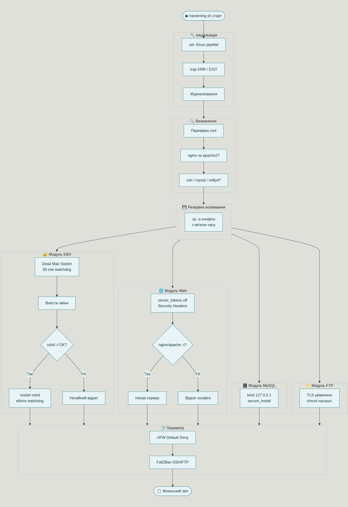

# Розділ 3. Проєктування, архітектура та реалізація системи автоматизованого hardening-у

## 3.1. Обґрунтування вибору Bash як основи автоматизації

Вибір технологічної основи для автоматизованого hardening-у — це не просто технічне рішення, а принципова відповідь на питання: для кого призначений цей інструмент і в яких умовах він буде використовуватись?

### Чому не Ansible

Ansible — потужний і добре задокументований інструмент, і для інфраструктури з десятками серверів він є природним вибором. Однак у контексті цієї роботи він має низку принципових обмежень.

По-перше, Ansible не є самодостатнім. Він вимагає окремого control node — машини, з якої виконується управління. На практиці це означає, що перед тим як захистити один сервер, потрібно спочатку налаштувати інший. Для вебмайстра, який хоче просто запустити своній VPS безпечно, це суттєвий бар'єр.

По-друге, поріг входу в Ansible є реальним і значним. Базове знайомство з інструментом займає кілька годин, але до рівня впевненого написання власних плейбуків з ролями, шаблонами Jinja2, handlers і vault-секретами — мінімум кілька тижнів практики. Це не аргумент проти Ansible як такого, але це прямо суперечить меті створення доступного інструменту для людини без глибокої підготовки в DevOps.

По-третє, YAML-конфігурація Ansible є декларативною і гнучкою, але "простою" вона є лише для тих, хто вже знайомий із її ідіомами. Синтаксичні помилки в YAML можуть бути неочевидними (залежність від відступів, особливості типізації значень), а їх налагодження потребує розуміння того, як Ansible інтерпретує конфігурацію. Bash у цьому сенсі прозоріший: кожен рядок — це конкретна команда, яку можна виконати вручну та перевірити.

### Чому Bash

Bash є вбудованою мовою автоматизації будь-якого Linux-сервера без жодних залежностей. Він не потребує встановлення, не потребує control node, не потребує налаштування інвентаризаційних файлів і мережевого доступу між вузлами. Скрипт на Bash — це один файл, який можна завантажити на сервер і запустити.

Bash природно підходить для задачі hardening-у, оскільки більшість операцій, які потрібно виконати, — це рівно ті самі команди, які адміністратор виконував би вручну: редагування конфігураційних файлів через `sed`, перевірка синтаксису через вбудовані інструменти сервісів, перезапуск служб через `systemctl`, налаштування правил фаєрвола через `ufw`. Bash просто записує ці дії в послідовність і виконує їх відтворювано.

### Обмеження Bash та як їх компенсувати

Bash не є типізованою мовою. Це означає, що помилка в регулярному виразі `sed`, який редагує конфіг SSH, може привести до некоректного результату без жодного повідомлення про помилку — скрипт просто продовжить виконання. Рядок, який мав бути змінений, залишиться незміненим або, гірше, буде змінений некоректно.

Саме тому в контексті hardening-у Bash-скрипт вимагає трьох обов'язкових компенсаційних механізмів, кожен з яких докладно описаний у підрозділі 3.3:

1. Резервне копіювання конфігурацій перед будь-якою зміною.
2. Синтаксична перевірка конфігурацій після внесення змін і до перезапуску сервісу.
3. Механізм автоматичного відкату для критичних сервісів (насамперед SSH).

За умови наявності цих трьох елементів Bash-скрипт стає цілком надійним інструментом для задачі hardening-у одного сервера.

---

## 3.2. Проєктування архітектури автоматизованого інструменту

Скрипт розроблений як модульний — кожен компонент стеку обробляється окремою функцією, яка може бути запущена незалежно або в складі повного циклу. Така архітектура дає кілька практичних переваг: простіше тестування, зрозуміліший код і можливість запустити hardening лише для конкретного сервісу без ризику зачепити решту.

### Загальна структура скрипта

```
hardening.sh
│
├── Ініціалізація
│   ├── set -Eeuo pipefail (режим суворого виконання)
│   ├── trap ERR / EXIT (обробка помилок і очищення)
│   └── Запуск модуля журналювання
│
├── Модуль визначення середовища
│   ├── Перевірка наявності root-прав
│   ├── Визначення активного веб-сервера (nginx чи apache2)
│   └── Перевірка наявності встановлених сервісів (ssh, mysql, vsftpd)
│
├── Модуль резервного копіювання
│   └── Копіювання конфігурацій перед будь-якими змінами
│
├── Модуль hardening-у SSH
├── Модуль hardening-у веб-сервера (Nginx або Apache)
├── Модуль hardening-у MySQL
├── Модуль hardening-у FTP
├── Модуль периметра (UFW + Fail2Ban)
│
└── Звіт про виконання
```



*Рисунок 3.1 — Архітектура автоматизованого інструменту hardening.sh*

### Модуль ініціалізації

Перший і найважливіший рядок виконуваного коду — це директива режиму виконання:

```bash
set -Eeuo pipefail
```

Кожна з цих опцій робить конкретну роботу. `set -e` зупиняє скрипт при першій же команді, що завершилась із помилкою, замість того щоб виконувати наступні команди в потенційно зламаному стані. `set -u` робить звернення до невизначеної змінної помилкою — це вловлює цілий клас помилок із помилковими іменами змінних. `set -o pipefail` поширює цю логіку на конвеєри команд: якщо будь-яка команда у `cmd1 | cmd2 | cmd3` зазнала невдачі, весь конвеєр вважається невдалим. `set -E` забезпечує успадкування обробника `ERR` функціями, що викликаються зі скрипта.

Разом ці опції перетворюють Bash із мови, яка "робить усе можливе і продовжує виконання за будь-яких обставин", на мову з чіткою семантикою відмови.

### Модуль визначення середовища

Скрипт не повинен сліпо намагатися налаштувати Nginx, якщо на сервері встановлений Apache, і навпаки. Тому першим кроком після ініціалізації є визначення реального стану системи:

```bash
detect_webserver() {
    if systemctl -q is-active nginx; then
        echo "nginx"
    elif systemctl -q is-active apache2; then
        echo "apache2"
    else
        echo "none"
    fi
}
```

Команда `systemctl is-active` повертає код виходу 0, якщо сервіс запущений, і ненульовий — якщо ні. Це дає змогу надійно визначити стан без парсингу текстового виведення. Аналогічна логіка застосовується для MySQL, vsftpd та інших компонентів. Результати визначення зберігаються у змінних і використовуються умовними блоками в кожному наступному модулі.

### Модуль резервного копіювання

Перед будь-якою зміною конфігураційного файлу скрипт зберігає його оригінальну копію з міткою часу:

```bash
backup_config() {
    local file="$1"
    local backup="${file}.bak.$(date +%Y%m%d_%H%M%S)"
    cp -a "$file" "$backup"
    log "Backup created: $backup"
}
```

Прапор `-a` у `cp` зберігає оригінальні права доступу, власника і мітки часу файлу — це важливо, оскільки конфігураційні файли SSH і MySQL мають специфічні дозволи, порушення яких може призвести до відмови сервісу від читання конфігурації. Шлях до backup-файлу фіксується в журналі разом з міткою часу, що дає можливість відновити будь-який стан вручну навіть після завершення скрипта.

---

## 3.3. Розробка механізмів відмовостійкості та захисту від помилок

Це найважливіший підрозділ з точки зору практичної надійності скрипта. Саме механізми відмовостійкості відрізняють hardening-інструмент, яким можна довіряти, від скрипта, який може закрити адміністратора з власного сервера.

### Dead Man's Switch для SSH

SSH-конфігурація є найризикованішою для автоматизованої зміни з однієї простої причини: якщо після зміни SSH перестане приймати з'єднання, адміністратор втрачає доступ до сервера. Без фізичного доступу або аварійної консолі у провайдера це може означати повну втрату керування машиною.

Dead Man's Switch — це техніка, яка вирішує цю проблему через принцип "якщо щось піде не так, я автоматично поверну все назад". Реалізація виглядає так:

```bash
ssh_safe_apply() {
    local backup_config="/etc/ssh/sshd_config.bak.$(date +%Y%m%d_%H%M%S)"

    # 1. Зберігаємо поточну конфігурацію
    cp -a /etc/ssh/sshd_config "$backup_config"

    # 2. Плануємо автоматичний відкат через 60 секунд
    (sleep 60 &&      cp -a "$backup_config" /etc/ssh/sshd_config &&      systemctl restart sshd &&      log "SSH config auto-reverted by Dead Man's Switch") &
    local watchdog_pid=$!

    # 3. Вносимо зміни та перевіряємо синтаксис
    apply_ssh_hardening

    if sshd -t; then
        # 4. Синтаксис коректний — перезапускаємо SSH
        systemctl restart sshd

        # 5. Перевіряємо, що SSH справді запустився
        sleep 3
        if systemctl -q is-active sshd; then
            # 6. Все добре — скасовуємо watchdog
            kill "$watchdog_pid" 2>/dev/null
            log "SSH hardening applied successfully"
        else
            # SSH запустився, але одразу впав — watchdog відкатить
            log "ERROR: sshd failed to stay active, watchdog will revert"
        fi
    else
        # 7. Синтаксична помилка — відкат негайно, без очікування
        kill "$watchdog_pid" 2>/dev/null
        cp -a "$backup_config" /etc/ssh/sshd_config
        log "ERROR: sshd -t failed, config reverted immediately"
    fi
}
```

Ключовий момент: watchdog-процес запускається у фоні ще до внесення змін. Якщо щось піде не так і основний процес скрипта зависне або завершиться з помилкою — watchdog все одно спрацює через 60 секунд і відновить оригінальну конфігурацію. Скасувати watchdog можна тільки явним `kill`, що відбувається лише після успішної перевірки.

### Попередня валідація синтаксису конфігурацій

Перед перезапуском будь-якого сервісу скрипт обов'язково перевіряє синтаксис конфігурації через вбудовані механізми самого сервісу:

```bash
validate_and_reload() {
    local service="$1"

    case "$service" in
        nginx)
            nginx -t || { log "ERROR: nginx config invalid"; return 1; }
            systemctl reload nginx
            ;;
        apache2)
            apache2ctl -t || { log "ERROR: apache2 config invalid"; return 1; }
            systemctl reload apache2
            ;;
        sshd)
            sshd -t || { log "ERROR: sshd config invalid"; return 1; }
            systemctl restart sshd
            ;;
        mysql)
            mysqld --validate-config 2>/dev/null ||                 { log "ERROR: mysql config invalid"; return 1; }
            systemctl restart mysql
            ;;
    esac
}
```

Команди `nginx -t` і `sshd -t` є вбудованими в самі сервіси і перевіряють конфігурацію так само, як це робить реальний запуск, але без фактичного перезапуску. Якщо перевірка виявляє помилку, функція повертає ненульовий код виходу, що в поєднанні з `set -e` зупиняє виконання скрипта і запускає обробник помилок.

### Безпечний перехід до автентифікації за SSH-ключами

Вимкнення парольної автентифікації в SSH є одним із найефективніших заходів безпеки, але і найнебезпечнішим для автоматизації: якщо вимкнути паролі до того, як SSH-ключ адміністратора додано в `authorized_keys`, адміністратор назавжди втратить доступ до сервера.

Скрипт вирішує цю проблему через обов'язкову перевірку:

```bash
disable_password_auth() {
    # Перевіряємо наявність хоча б одного authorized_keys
    local has_keys=false

    while IFS=: read -r username _ uid _ _ home _; do
        if [ "$uid" -ge 1000 ] || [ "$username" = "root" ]; then
            if [ -s "${home}/.ssh/authorized_keys" ]; then
                has_keys=true
                break
            fi
        fi
    done < /etc/passwd

    if [ "$has_keys" = false ]; then
        log "WARNING: No SSH keys found in authorized_keys."
        log "Skipping PasswordAuthentication disable to prevent lockout."
        log "Add your SSH key first, then re-run this module."
        return 0
    fi

    sed -i 's/^#*PasswordAuthentication.*/PasswordAuthentication no/'         /etc/ssh/sshd_config
    log "PasswordAuthentication disabled (keys confirmed present)"
}
```

Якщо жодного ключа не знайдено, скрипт не вимикає парольну автентифікацію і повідомляє адміністратора про причину. Це приклад того, як скрипт може бути розумнішим за просту послідовність команд.

### Обробка помилок через trap

Глобальний обробник помилок реєструється на початку скрипта через `trap`:

```bash
cleanup_on_error() {
    local exit_code=$?
    local line_number=$1
    log "ERROR: Script failed at line ${line_number} with exit code ${exit_code}"
    log "Attempting to restore backups..."
    restore_all_backups
    exit "$exit_code"
}

trap 'cleanup_on_error $LINENO' ERR
```

Якщо будь-яка команда завершується з помилкою (при активному `set -e`), `trap ERR` перехоплює цю подію, фіксує номер рядка і код помилки в журналі і запускає процедуру відновлення резервних копій. Це гарантує, що навіть непередбачена помилка в середині скрипта не залишить систему в частково зміненому, непослідовному стані.

---

## 3.4. Логіка журналювання та контроль виконаних дій

Журналювання в hardening-скрипті — це не зручність, а вимога. Без детального запису того, що саме і коли було змінено, неможливо ні перевірити ефективність hardening-у, ні налагодити проблему, ні відтворити результат.

### Структура журналу

Скрипт веде два паралельних журнали. Перший — це власний лог-файл з деталізованими записами про кожну дію:

```
[2026-05-20 18:45:01] [INFO]  Starting hardening.sh v1.0
[2026-05-20 18:45:01] [INFO]  Detected web server: nginx
[2026-05-20 18:45:02] [INFO]  Backup created: /etc/ssh/sshd_config.bak.20260520_184502
[2026-05-20 18:45:02] [INFO]  SSH: PermitRootLogin set to no
[2026-05-20 18:45:02] [INFO]  SSH: PasswordAuthentication disabled (keys confirmed)
[2026-05-20 18:45:03] [INFO]  sshd -t: OK
[2026-05-20 18:45:03] [INFO]  sshd restarted successfully
[2026-05-20 18:45:04] [INFO]  Dead Man's Switch watchdog cancelled (PID 12847)
```

Другий канал журналювання — це `logger`, який дублює ключові події в системний syslog (`/var/log/syslog`). Це дає змогу побачити дії скрипта в контексті інших системних подій, що особливо корисно при налагодженні.

### Функція логування

```bash
LOG_FILE="/var/log/hardening_$(date +%Y%m%d_%H%M%S).log"

log() {
    local level="${2:-INFO}"
    local message="$1"
    local timestamp
    timestamp="$(date '+%Y-%m-%d %H:%M:%S')"
    echo "[${timestamp}] [${level}]  ${message}" | tee -a "$LOG_FILE"
    logger -t "hardening.sh" "[${level}] ${message}"
}
```

Команда `tee -a` одночасно виводить повідомлення в термінал (щоб адміністратор бачив прогрес у реальному часі) та дописує його в лог-файл. `logger` передає подію в syslog.

### Фінальний звіт

Після завершення всіх модулів скрипт генерує структурований підсумок виконаних змін, де зазначено: які модулі були виконані, які дії внесені, де зберігаються резервні копії та що потребує ручної перевірки. Цей звіт зберігається окремим файлом і є основою для порівняльного аудиту в Розділі 4.

---

## 3.5. Модуль hardening-у SSH

Модуль SSH є першим у порядку виконання і найвідповідальнішим з точки зору ризиків: некоректні зміни в `/etc/ssh/sshd_config` можуть позбавити адміністратора доступу до сервера. Саме тому цей модуль загорнуто у Dead Man's Switch, описаний у підрозділі 3.3. Усі зміни вносяться через `sed` з наступною обов'язковою перевіркою `sshd -t` перед перезапуском сервісу.

### Директиви, що змінюються

**`PermitRootLogin no`** — забороняє прямий вхід під обліковим записом root по SSH. Навіть якщо зловмисник підбере або отримає пароль root, він не зможе безпосередньо автентифікуватись як root по SSH. Адміністрування виконується через непривілейованого користувача з подальшим переходом через `sudo`. Це не обмежує функціональність, але суттєво звужує вектор атаки: будь-яка успішна атака тепер вимагає щонайменше двох кроків — компрометації непривілейованого облікового запису і підвищення привілеїв.

**`PasswordAuthentication no`** — вимикає парольну автентифікацію і залишає лише автентифікацію за SSH-ключами. Парольна автентифікація є мішенню для brute-force атак і credential stuffing — обох автоматизованих класів атак. SSH-ключі за своєю природою не підбираються перебором: 2048-бітний RSA-ключ або Ed25519 є криптографічно непереборними при нинішньому рівні обчислювальних потужностей. Як зазначено в підрозділі 3.3, ця директива активується тільки після підтвердження наявності SSH-ключа в `authorized_keys` хоча б одного користувача.

**`MaxAuthTries 3`** — обмежує кількість спроб автентифікації в рамках одного TCP-з'єднання. Після трьох невдалих спроб SSH-сервер примусово закриває з'єднання. Це уповільнює автоматизовані атаки: замість нескінченних спроб у рамках одного з'єднання зловмисник змушений встановлювати нове з'єднання після кожних трьох спроб, що генерує більше помітного мережевого трафіку і дає Fail2Ban більше подій для аналізу.

**`LoginGraceTime 20`** — скорочує часове вікно між встановленням TCP-з'єднання і успішною автентифікацією з дефолтних 120 до 20 секунд. Пряма relevance до CVE-2024-6387 (regreSSHion), описаної у підрозділі 1.4.1: менший `LoginGraceTime` означає менший часовий інтервал, у якому SIGALRM може бути використаний для race condition. Крім того, це зменшує вплив атак типу "hold connection open" — спроб тримати відкрите TCP-з'єднання, не завершуючи автентифікацію, щоб блокувати ліміти з'єднань сервера.

**`AllowUsers`** — директива білого списку: лише явно перелічені в ній користувачі можуть авторизуватися по SSH. Усі інші системні облікові записи (www-data, mysql, daemon та ін.) автоматично блокуються на рівні SSH, навіть якщо у них є пароль або ключ. Скрипт визначає поточного залогованого користувача (`SUDO_USER` або поточний `$USER`) і встановлює `AllowUsers` для нього.

**`X11Forwarding no`** та **`AllowAgentForwarding no`** — вимикають функції, які не потрібні для типового серверного адміністрування і збільшують поверхню атаки. X11 Forwarding дозволяє пробрасувати графічний дисплей через SSH-тунель, що в серверному контексті є ризиком без жодної практичної користі. Agent Forwarding дозволяє транзитивне використання SSH-ключів через проміжний сервер — при компрометації цього сервера ключі можуть бути використані атакуючим.

**`ClientAliveInterval 300` / `ClientAliveCountMax 2`** — механізм keepalive, який закриває "завислі" SSH-сесії: якщо клієнт не відповідає протягом 300 секунд і ігнорує два перевірочних пакети, з'єднання закривається автоматично. Це звільняє ресурси сервера і скорочує кількість відкритих сесій від покинутих підключень.

**Зміна стандартного порту.** Перенесення SSH з порту 22 на нестандартний порт (наприклад, 2222) не є криптографічним захистом і не зупинить цілеспрямованого зловмисника. Однак воно ефективно відфільтровує масовий автоматизований шум: більшість ботів і automated scanners перевіряють лише порт 22. Скрипт запитує у адміністратора бажаний порт або використовує значення за замовчуванням 2222, а також автоматично оновлює правила UFW відповідно до нового порту.

### Реалізація в скрипті

```bash
apply_ssh_hardening() {
    local cfg="/etc/ssh/sshd_config"

    sed -i 's/^#*PermitRootLogin.*/PermitRootLogin no/'             "$cfg"
    sed -i 's/^#*MaxAuthTries.*/MaxAuthTries 3/'                    "$cfg"
    sed -i 's/^#*LoginGraceTime.*/LoginGraceTime 20/'               "$cfg"
    sed -i 's/^#*X11Forwarding.*/X11Forwarding no/'                 "$cfg"
    sed -i 's/^#*AllowAgentForwarding.*/AllowAgentForwarding no/'   "$cfg"
    sed -i 's/^#*ClientAliveInterval.*/ClientAliveInterval 300/'    "$cfg"
    sed -i 's/^#*ClientAliveCountMax.*/ClientAliveCountMax 2/'      "$cfg"

    # Безпечне вимкнення парольної автентифікації
    disable_password_auth

    # AllowUsers — тільки поточний адміністратор
    local admin_user="${SUDO_USER:-$USER}"
    if ! grep -q "^AllowUsers" "$cfg"; then
        echo "AllowUsers ${admin_user}" >> "$cfg"
        log "SSH: AllowUsers set to ${admin_user}"
    fi

    log "SSH hardening directives applied"
}
```

Перед перезапуском SSH завжди виконується `sshd -t`. Модуль огорнутий у `ssh_safe_apply`, описаний у підрозділі 3.3.

---

## 3.6. Модуль hardening-у веб-сервера

Модуль веб-сервера обробляє Nginx або Apache залежно від результату `detect_webserver()`, визначеного при ініціалізації. Незважаючи на різницю у синтаксисі конфігураційних файлів, логіка і цілі однакові: прибрати розкриття технічної інформації, додати захисні HTTP-заголовки і вимкнути небезпечні дефолтні функції.

### Приховування версії сервера

**Nginx: `server_tokens off`** — директива в блоці `http {}` файлу `/etc/nginx/nginx.conf`. За замовчуванням Nginx включає рядок виду `nginx/1.24.0` у заголовок `Server` кожної відповіді та на сторінках помилок. Після `server_tokens off` заголовок містить лише `nginx` без версії.

**Apache: `ServerTokens Prod`** та **`ServerSignature Off`** — еквівалентне рішення для Apache. `ServerTokens Prod` залишає лише рядок `Apache` у заголовку. `ServerSignature Off` прибирає рядок із версією з автоматично генерованих сторінок помилок і директорійних лістингів.

### HTTP security headers

Захисні HTTP-заголовки — це інструкції браузеру щодо того, як він має обробляти контент сторінки. Вони не захищають сервер безпосередньо, але захищають користувачів від низки атак, які стають можливими навіть при коректно написаному серверному коді.

**`X-Frame-Options: SAMEORIGIN`** — забороняє вбудовування сторінки в `<iframe>` на сторонніх сайтах. Без цього заголовку зловмисник може розмістити сторінку сайту в невидимому фреймі поверх своєї сторінки і змусити користувача клацнути по прихованих елементах управління (clickjacking).

**`X-Content-Type-Options: nosniff`** — забороняє браузеру виконувати MIME-sniffing: самостійно визначати тип контенту, ігноруючи заголовок `Content-Type`. Без цього заголовку браузер може виконати JavaScript, якщо скрипт завантажений як зображення або текстовий файл — вектор, який використовувався в реальних атаках.

**`Referrer-Policy: strict-origin-when-cross-origin`** — контролює, яка інформація з URL передається в заголовку `Referer` при переходах. Рекомендоване значення передає повний URL лише при переходах у межах того самого origin, а для зовнішніх переходів — тільки домен без шляху і параметрів. Це запобігає витоку токенів, ідентифікаторів сесій та іншої чутливої інформації, яка може бути частиною URL.

**`Content-Security-Policy` в режимі Report-Only** — CSP є потужним механізмом обмеження джерел ресурсів (скриптів, стилів, зображень), але агресивна CSP може зламати функціональність застосунку. Саме тому скрипт встановлює її в режимі `Content-Security-Policy-Report-Only` з базовою політикою `default-src 'self'`. У цьому режимі браузер не блокує порушення, але повідомляє про них (якщо налаштований endpoint для звітів). Це дає адміністратору можливість побачити, які ресурси порушували б повну CSP, і налаштувати політику перед її активацією.

**`Permissions-Policy`** — обмежує доступ браузера до чутливих API (геолокація, камера, мікрофон) для сторінок сайту. Базове значення `geolocation=(), camera=(), microphone=()` забороняє всі три для цього origin.

### Вимкнення directory listing

Автоматичне відображення вмісту директорії при відсутності index-файлу є небезпечною функцією, яка може розкривати структуру файлової системи, резервні копії і тимчасові файли.

Для Nginx директива `autoindex off` встановлюється в конфігурації сервера. Для Apache відповідна директива `Options -Indexes` прибирає флаг Indexes з дозволів директорії.

### Реалізація в скрипті

```bash
apply_webserver_hardening() {
    local ws
    ws="$(detect_webserver)"

    if [ "$ws" = "nginx" ]; then
        local cfg="/etc/nginx/nginx.conf"
        backup_config "$cfg"

        # server_tokens off в блоці http
        sed -i '/http\s*{/a\\tserver_tokens off;' "$cfg"

        # Security headers через snippets
        cat > /etc/nginx/snippets/security-headers.conf << 'EOF'
add_header X-Frame-Options "SAMEORIGIN" always;
add_header X-Content-Type-Options "nosniff" always;
add_header Referrer-Policy "strict-origin-when-cross-origin" always;
add_header Content-Security-Policy-Report-Only "default-src 'self'" always;
add_header Permissions-Policy "geolocation=(), camera=(), microphone=()" always;
EOF
        # Підключення snippets у default server block
        sed -i '/listen 80/a\\tinclude snippets/security-headers.conf;' \
            /etc/nginx/sites-available/default

        # Вимкнення autoindex
        sed -i 's/autoindex on/autoindex off/g' /etc/nginx/sites-available/default

        validate_and_reload nginx

    elif [ "$ws" = "apache2" ]; then
        local cfg="/etc/apache2/conf-available/security.conf"
        backup_config "$cfg"

        sed -i 's/^ServerTokens.*/ServerTokens Prod/'   "$cfg"
        sed -i 's/^ServerSignature.*/ServerSignature Off/' "$cfg"

        cat > /etc/apache2/conf-available/security-headers.conf << 'EOF'
Header always set X-Frame-Options "SAMEORIGIN"
Header always set X-Content-Type-Options "nosniff"
Header always set Referrer-Policy "strict-origin-when-cross-origin"
Header always set Content-Security-Policy-Report-Only "default-src 'self'"
Header always set Permissions-Policy "geolocation=(), camera=(), microphone=()"
EOF
        a2enmod headers
        a2enconf security-headers

        # Вимкнення Indexes глобально
        sed -i 's/Options Indexes/Options -Indexes/g' \
            /etc/apache2/apache2.conf

        validate_and_reload apache2
    fi
}
```

---

## 3.7. Модуль hardening-у MySQL

MySQL-модуль вирішує два незалежних класи проблем: мережеву доступність і стан після інсталяції. Обидва повністю усуваються конфігурацією без жодної функціональної втрати для типового веб-застосунку.

### Обмеження мережевого прослуховування

Директива **`bind-address = 127.0.0.1`** в секції `[mysqld]` файлу `/etc/mysql/mysql.conf.d/mysqld.cnf` наказує MySQL приймати з'єднання лише з loopback-інтерфейсу. Для типового веб-сайту, де вебсервер і база даних знаходяться на одній машині, це не створює жодних обмежень: всі запити від PHP/Python/Node.js до MySQL проходять через localhost і продовжують працювати. Натомість зовнішній порт 3306 стає недоступним — без жодних правил файрволу.

Скрипт перевіряє, чи директива вже присутня в конфігурації, і або додає її, або змінює існуюче значення:

```bash
apply_mysql_network_hardening() {
    local cfg="/etc/mysql/mysql.conf.d/mysqld.cnf"
    backup_config "$cfg"

    if grep -q "^bind-address" "$cfg"; then
        sed -i 's/^bind-address.*/bind-address = 127.0.0.1/' "$cfg"
    else
        sed -i '/^\[mysqld\]/a bind-address = 127.0.0.1' "$cfg"
    fi

    log "MySQL: bind-address set to 127.0.0.1"
}
```

### Безпечна ініціалізація: програмний еквівалент mysql_secure_installation

Утиліта `mysql_secure_installation` є інтерактивною і не може бути викликана в автоматизованому скрипті без додаткових інструментів. Скрипт реалізує еквівалентний набір SQL-операцій через прямий виклик MySQL-клієнта:

```bash
apply_mysql_secure_init() {
    # Видалення анонімних користувачів
    mysql -u root << 'EOF'
DELETE FROM mysql.user WHERE User='';
EOF

    # Заборона віддаленого root-входу
    mysql -u root << 'EOF'
DELETE FROM mysql.user
    WHERE User='root' AND Host NOT IN ('localhost', '127.0.0.1', '::1');
EOF

    # Видалення тестової бази даних
    mysql -u root << 'EOF'
DROP DATABASE IF EXISTS test;
DELETE FROM mysql.db WHERE Db='test' OR Db='test\\_%';
EOF

    # Застосування змін
    mysql -u root -e "FLUSH PRIVILEGES;"

    log "MySQL: anonymous users removed, test DB dropped, remote root blocked"
}
```

Анонімний користувач (`User=''`) — це обліковий запис, який дозволяє підключитись до MySQL без вказання імені користувача. Він існує в дефолтній установці для зручності тестування, але в продуктивному середовищі є прямою вразливістю. Аналогічно, тестова база `test` з публічними дозволами на запис надає будь-якому локальному процесу можливість записувати дані в MySQL без автентифікації.

Заборона root-входу з будь-якого хоста, крім localhost, гарантує, що навіть якщо root-пароль MySQL стане відомим зловмиснику, він не зможе підключитись ззовні — навіть якщо `bind-address` з якоїсь причини буде скинутий.

Після виконання всіх змін модуль перезапускає MySQL із перевіркою синтаксису конфігурації через `validate_and_reload mysql`.

---

## 3.8. Модуль hardening-у FTP

Модуль vsftpd усуває дві фундаментальні проблеми класичного FTP: передачу облікових даних відкритим текстом і відсутність ізоляції користувачів. Обидві вирішуються через конфігурацію без заміни самого сервісу.

### Увімкнення шифрування FTPS

**`ssl_enable=YES`** — увімкнення підтримки TLS у vsftpd. Після цього клієнт може встановити зашифроване з'єднання, яке захищає передачу облікових даних і даних від перехоплення. Додатково встановлюються директиви, що деталізують поведінку TLS:

**`force_local_logins_ssl=YES`** та **`force_local_data_ssl=YES`** — вимагають TLS як для каналу автентифікації, так і для каналу передачі даних. Без цих директив TLS лише дозволено, але не обов'язково — клієнт може підключитись без шифрування. Ці директиви роблять TLS обов'язковою вимогою.

**`ssl_tlsv1_2=YES`** та **`ssl_sslv2=NO` / `ssl_sslv3=NO`** — явна вказівка використовувати лише TLS 1.2 і вище, відключаючи застарілі SSLv2, SSLv3 і TLS 1.0/1.1. Це узгоджується із загальносистемною політикою Ubuntu 24.04, де старі версії TLS вже відключені за замовчуванням.

**`rsa_cert_file`** та **`rsa_private_key_file`** — шляхи до TLS-сертифіката і ключа. Якщо у системі вже є Let's Encrypt сертифікат (у `/etc/letsencrypt/live/`), скрипт використовує його. Якщо немає — генерує self-signed сертифікат через `openssl req -new -x509` для тестового середовища, фіксуючи в журналі, що для продуктивного середовища потрібен реальний сертифікат.

### Ізоляція користувачів через chroot

**`chroot_local_user=YES`** — ключова директива ізоляції: кожен FTP-користувач після входу бачить свою домашню директорію як корінь файлової системи. Він не може вийти за її межі і переміщатись по системних директоріях. Це захищає і від навмисних дій зловмисника, який отримав FTP-доступ, і від випадкового видалення системних файлів.

**`allow_writeable_chroot=YES`** — дозвіл, необхідний для коректної роботи chroot, якщо домашня директорія є доступною для запису. Без цього vsftpd відмовляє в доступі, оскільки домашня директорія, доступна для запису в chroot, теоретично може бути використана для атак. Для типового веб-хостингу, де користувач повинен мати можливість завантажувати файли у свою директорію, ця директива є необхідною.

### Обмеження пасивного порт-діапазону

FTP у пасивному режимі (PASV) відкриває динамічні порти для передачі даних. За замовчуванням vsftpd може використовувати будь-який порт із широкого діапазону 1024–65535, що унеможливлює точне налаштування файрволу: відкрити всі ці порти — означає залишити великий пролом у периметрі.

**`pasv_min_port=40000`** та **`pasv_max_port=40099`** — обмеження пасивного діапазону до 100 конкретних портів. Це дозволяє UFW відкрити саме ці 100 портів і нічого більше, зберігаючи баланс між функціональністю PASV-режиму і мінімальністю відкритої поверхні.

### Реалізація в скрипті

```bash
apply_ftp_hardening() {
    local cfg="/etc/vsftpd.conf"
    backup_config "$cfg"

    # TLS
    sed -i 's/^#*ssl_enable.*/ssl_enable=YES/'                    "$cfg"
    sed -i 's/^#*force_local_logins_ssl.*/force_local_logins_ssl=YES/' "$cfg"
    sed -i 's/^#*force_local_data_ssl.*/force_local_data_ssl=YES/'     "$cfg"
    sed -i 's/^#*ssl_sslv2.*/ssl_sslv2=NO/'                          "$cfg"
    sed -i 's/^#*ssl_sslv3.*/ssl_sslv3=NO/'                          "$cfg"
    sed -i 's/^#*ssl_tlsv1_2.*/ssl_tlsv1_2=YES/'                     "$cfg"

    # chroot
    sed -i 's/^#*chroot_local_user.*/chroot_local_user=YES/'          "$cfg"
    grep -q "allow_writeable_chroot" "$cfg" || \
        echo "allow_writeable_chroot=YES" >> "$cfg"

    # Пасивний діапазон
    grep -q "pasv_min_port" "$cfg" || \
        printf 'pasv_min_port=40000\npasv_max_port=40099\n' >> "$cfg"

    # Сертифікат
    provision_ftp_certificate "$cfg"

    systemctl restart vsftpd
    log "FTP hardening applied: TLS enabled, chroot enabled, PASV 40000-40099"
}
```

---

## 3.9. Модуль периметра: UFW та Fail2Ban

Периметровий модуль є завершальним і охоплює мережевий захист на рівні операційної системи. На відміну від попередніх модулів, які змінювали конфігурацію конкретних сервісів, цей модуль встановлює глобальну мережеву політику: що дозволено, що заборонено і як автоматично реагувати на атаки.

### Конфігурація UFW

**Стратегія default deny.** Базова ідея проста: забороняємо всі вхідні з'єднання, потім явно дозволяємо лише ті, що необхідні. Це принципово відрізняється від протилежної логіки (дозволити все, крім явно забороненого): при default deny кожен новий порт, відкритий будь-яким сервісом, залишається закритим до явного рішення адміністратора.

```bash
apply_ufw_rules() {
    local ssh_port="${SSH_PORT:-2222}"

    ufw --force reset
    ufw default deny incoming
    ufw default allow outgoing

    # SSH на вибраному порті
    ufw allow "${ssh_port}/tcp" comment 'SSH'

    # Веб
    ufw allow 80/tcp   comment 'HTTP'
    ufw allow 443/tcp  comment 'HTTPS'

    # FTP і пасивний діапазон (тільки якщо vsftpd встановлений)
    if systemctl -q is-enabled vsftpd 2>/dev/null; then
        ufw allow 21/tcp      comment 'FTP control'
        ufw allow 40000:40099/tcp comment 'FTP passive range'
    fi

    ufw --force enable
    log "UFW enabled: default deny, SSH:${ssh_port}, HTTP, HTTPS$(systemctl -q is-enabled vsftpd 2>/dev/null && echo ', FTP+PASV')"
}
```

`ufw --force reset` на початку скидає всі попередні правила, забезпечуючи передбачуваний стан перед застосуванням нових. `--force` відключає інтерактивне підтвердження, необхідне для неінтерактивного виконання скрипта.

Порт MySQL 3306 свідомо не відкривається: після застосування модуля 3.7 MySQL прослуховує лише на localhost, і будь-який зовнішній трафік до 3306 є неочікуваним і небажаним.

### Конфігурація Fail2Ban

Fail2Ban аналізує журнали системних сервісів і блокує IP-адреси, що демонструють підозрілу активність (багато невдалих спроб автентифікації за короткий час). На відміну від статичного файрволу, це динамічний захист, що адаптується до атак у реальному часі.

Fail2Ban налаштовується через `jail.local` — файл, який перевизначає значення за замовчуванням із `jail.conf`. Пряма зміна `jail.conf` є поганою практикою: оновлення пакета перезаписує цей файл. `jail.local` залишається незайманим при оновленнях.

**Jail для SSH:**

```ini
[sshd]
enabled   = true
port      = 2222
filter    = sshd
logpath   = %(sshd_log)s
maxretry  = 5
findtime  = 600
bantime   = 3600
```

`maxretry = 5` — після п'яти невдалих спроб протягом `findtime = 600` секунд (10 хвилин) IP блокується на `bantime = 3600` секунд (1 годину). `port = 2222` узгоджується зі зміненим портом SSH із модуля 3.5. `logpath = %(sshd_log)s` — це змінна Fail2Ban, яка автоматично вирішується в правильний шлях до логу SSH залежно від дистрибутива (в Ubuntu 24.04 це `/var/log/auth.log`).

**Jail для FTP:**

```ini
[vsftpd]
enabled   = true
port      = ftp,ftp-data,ftps,ftps-data
filter    = vsftpd
logpath   = %(vsftpd_log)s
maxretry  = 5
findtime  = 600
bantime   = 3600
```

**Jail для HTTP (захист від сканерів і brute-force веб-форм):**

```ini
[nginx-http-auth]
enabled  = true
port     = http,https
filter   = nginx-http-auth
logpath  = /var/log/nginx/error.log
maxretry = 10
findtime = 600
bantime  = 1800
```

### Реалізація в скрипті

```bash
apply_fail2ban_config() {
    local ssh_port="${SSH_PORT:-2222}"
    local jail_local="/etc/fail2ban/jail.local"

    backup_config "$jail_local" 2>/dev/null || true  # може не існувати

    cat > "$jail_local" << EOF
[DEFAULT]
bantime  = 3600
findtime = 600
maxretry = 5
backend  = systemd

[sshd]
enabled  = true
port     = ${ssh_port}
filter   = sshd
logpath  = %(sshd_log)s

[vsftpd]
enabled  = $(systemctl -q is-enabled vsftpd 2>/dev/null && echo true || echo false)
port     = ftp,ftp-data,ftps,ftps-data
filter   = vsftpd
logpath  = %(vsftpd_log)s

[nginx-http-auth]
enabled  = $([ "$(detect_webserver)" = "nginx" ] && echo true || echo false)
port     = http,https
filter   = nginx-http-auth
logpath  = /var/log/nginx/error.log
EOF

    systemctl enable --now fail2ban
    systemctl restart fail2ban
    log "Fail2Ban configured: SSH jail (port ${ssh_port}), vsftpd jail, nginx-http-auth jail"
}
```

`backend = systemd` вказує Fail2Ban читати логи через `journald` (systemd journal) замість текстових файлів — це рекомендований підхід для Ubuntu 24.04, де systemd є основним механізмом логування.

### Підсумковий захисний контур

Після виконання всіх п'яти модулів (3.5–3.9) система набуває узгодженого захисного стану: SSH захищений від brute-force на рівні конфігурації і на рівні Fail2Ban; веб-сервер не розкриває технічні деталі і додає браузерні захисні заголовки; MySQL доступна лише з localhost; FTP шифрує трафік і ізолює користувачів; UFW гарантує, що жоден незапланований порт не є доступним ззовні. Ці заходи є взаємодоповнюючими: відмова одного рівня захисту не скасовує решту.
